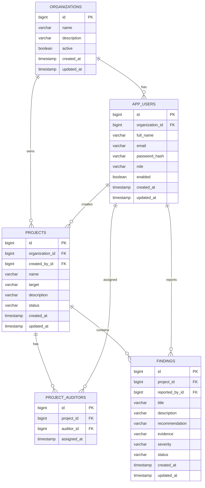

# AuditFlow Backend

AuditFlow is a fullstack MVP for managing security audit projects and vulnerability findings.

This repository contains the **Backend API** built with **Java**, **Spring Boot**, **Spring Security**, **Spring Data JPA**, **Hibernate**, **PostgreSQL** and **Maven**.

The backend is responsible for authentication, authorization, role-based access control, project management, finding management, auditor assignments, multi-tenant isolation and secure API access.

---

## 1. Production URLs

| Service | URL |
|---|---|
| Frontend | https://auditflow-frontend-three.vercel.app |
| Backend API | https://auditflow-backend-ts95.onrender.com |
| Backend Health Check | https://auditflow-backend-ts95.onrender.com/api/health |

Health check endpoint:

```txt
GET /api/health
```

Expected response:

```json
{
  "status": "UP",
  "service": "auditflow-backend"
}
```

---

## 2. Repositories

| Layer | Repository |
|---|---|
| Frontend | https://github.com/geovanni143/auditflow-frontend |
| Backend | https://github.com/geovanni143/auditflow-backend |

---

## 3. Demo Credentials

The production database includes demo data so the application can be tested quickly.

### Main demo organization

```txt
Organization:
N3X Security

Admin:
admin@auditflow.local
Admin123!

Auditor:
auditor@auditflow.local
Auditor123!
```

### Additional organization for multi-tenant testing

```txt
Organization:
Acme Security Labs

Admin:
admin.acme@auditflow.local
Admin123!

Auditor:
auditor.acme@auditflow.local
Auditor123!
```

The second organization is included to validate that data from one tenant is not visible from another tenant.

---

## 4. Technical Stack

### Backend

- Java 17
- Spring Boot
- Spring Security
- Spring Data JPA
- Hibernate
- PostgreSQL
- Maven
- JWT
- HTTPOnly cookies
- Docker

### Frontend

- Next.js
- React
- TypeScript
- Tailwind CSS
- App Router

### Infrastructure

- Backend: Render
- Frontend: Vercel
- Database: Neon PostgreSQL

---

## 5. Main Objective

The objective of AuditFlow is to provide a secure MVP for managing audit projects and vulnerability findings.

The platform supports:

- User registration and login.
- Role-based access control.
- Organization-based data isolation.
- Project management.
- Auditor assignment to projects.
- Finding management inside assigned projects.
- Global findings list with filters and pagination.
- Secure cookie-based session handling.
- Backend authorization on protected endpoints.

---

## 6. Functional Modules

### Module 1 — Authentication and Authorization

The backend supports:

- Public registration.
- Login.
- Logout.
- Current authenticated user endpoint.
- Admin role.
- Auditor role.
- HTTPOnly cookie session.
- Backend-enforced authorization.

Supported roles:

| Role | Description |
|---|---|
| ADMIN | Manages the organization, users, projects and auditor assignments |
| AUDITOR | Works only with assigned projects and related findings |

Main endpoints:

```txt
POST /api/auth/register
POST /api/auth/login
POST /api/auth/logout
GET  /api/auth/me
```

---

### Module 2 — Project Management

Admins can manage audit projects.

Project fields:

- Name.
- Client / target.
- Description.
- Status.

Supported project statuses:

```txt
DRAFT
ACTIVE
IN_REVIEW
COMPLETED
ARCHIVED
```

Main rules:

- Admins can create projects.
- Admins can update projects.
- Admins can delete projects.
- Admins can assign auditors to projects.
- Auditors can only see assigned projects.
- Auditors cannot create, update or delete projects.

Main endpoints:

```txt
GET    /api/projects
POST   /api/projects
GET    /api/projects/{id}
PUT    /api/projects/{id}
DELETE /api/projects/{id}
POST   /api/projects/{id}/auditors
```

---

### Module 3 — Findings Management

Findings represent vulnerabilities or security issues discovered during an audit.

Finding fields:

- Title.
- Description.
- Recommendation.
- Evidence.
- Severity.
- Status.
- Related project.
- Reporting user.

Supported severities:

```txt
LOW
MEDIUM
HIGH
CRITICAL
```

Supported finding statuses:

```txt
OPEN
IN_PROGRESS
RESOLVED
CLOSED
FALSE_POSITIVE
```

Challenge wording equivalence:

| Challenge wording | Current implementation |
|---|---|
| Draft | IN_PROGRESS |
| Published | OPEN |
| Mitigated | RESOLVED |

Main rules:

- Admins can view findings from their organization.
- Auditors can view findings from assigned projects.
- Auditors can create findings only in assigned projects.
- Users cannot access findings from another organization.

Main endpoints:

```txt
GET    /api/findings
POST   /api/findings
GET    /api/findings/{id}
PUT    /api/findings/{id}
DELETE /api/findings/{id}
```

---

### Module 4 — Findings List, Filters and Pagination

The backend supports a global findings list with filters and pagination.

Supported filters:

- Severity.
- Status.
- Project.
- Page.
- Size.

Example requests:

```txt
GET /api/findings?page=0&size=10
GET /api/findings?severity=HIGH&page=0&size=10
GET /api/findings?status=OPEN&page=0&size=10
GET /api/findings?severity=CRITICAL&status=OPEN&page=0&size=10
GET /api/findings?projectId=1&severity=HIGH&page=0&size=10
```

The frontend reflects these filters in the URL.

---

## 7. Security Requirements Covered

The backend was designed to comply with the non-negotiable security requirements of the technical challenge.

### Session Security

- JWT tokens are not stored in `localStorage`.
- JWT tokens are not stored in `sessionStorage`.
- The token is stored in an HTTPOnly cookie.
- The cookie uses `Secure` in production.
- The cookie uses `SameSite=None` in production to support the deployed frontend/backend domains.
- The frontend sends requests using `credentials: "include"`.

### Backend Authorization

Authorization is enforced in the backend, not only in the frontend.

Examples:

- An auditor cannot create projects by calling the API directly.
- An auditor cannot update projects by calling the API directly.
- An auditor cannot delete projects by calling the API directly.
- An auditor cannot manage users.
- An auditor cannot create findings in unassigned projects.
- A user cannot access resources from another organization.

### Multi-tenant Isolation

The application supports multiple organizations.

Every user belongs to one organization.

Every project belongs to one organization.

Findings belong to projects, and therefore findings are indirectly scoped to the same organization as the project.

This design prevents cross-tenant data leaks and IDOR issues.

---

## 8. Environment Variables

### Local development example

```env
PORT=8080

SPRING_DATASOURCE_URL=jdbc:postgresql://localhost:15432/auditflow_db
SPRING_DATASOURCE_USERNAME=auditflow_user
SPRING_DATASOURCE_PASSWORD=auditflow_password

JWT_SECRET=auditflow-dev-secret-key-minimum-32-characters-123456
JWT_EXPIRATION_MS=86400000

COOKIE_NAME=access_token
COOKIE_SECURE=false
COOKIE_SAME_SITE=Lax
COOKIE_MAX_AGE_SECONDS=86400

CORS_ALLOWED_ORIGINS=http://localhost:3000

SPRING_JPA_HIBERNATE_DDL_AUTO=update
SPRING_JPA_SHOW_SQL=true
HIBERNATE_SQL_LOG_LEVEL=DEBUG
SPRING_SECURITY_LOG_LEVEL=INFO
SPRING_DEVTOOLS_RESTART_ENABLED=true
```

### Production example

```env
PORT=8080

SPRING_DATASOURCE_URL=jdbc:postgresql://YOUR_NEON_HOST/YOUR_DATABASE?sslmode=require
SPRING_DATASOURCE_USERNAME=YOUR_DATABASE_USER
SPRING_DATASOURCE_PASSWORD=YOUR_DATABASE_PASSWORD

JWT_SECRET=YOUR_SECURE_RANDOM_SECRET
JWT_EXPIRATION_MS=86400000

COOKIE_NAME=access_token
COOKIE_SECURE=true
COOKIE_SAME_SITE=None
COOKIE_MAX_AGE_SECONDS=86400

CORS_ALLOWED_ORIGINS=https://auditflow-frontend-three.vercel.app

SPRING_JPA_HIBERNATE_DDL_AUTO=update
SPRING_JPA_SHOW_SQL=false
HIBERNATE_SQL_LOG_LEVEL=INFO
SPRING_SECURITY_LOG_LEVEL=INFO
SPRING_DEVTOOLS_RESTART_ENABLED=false
```

Important:

```txt
Do not commit real production secrets.
Do not commit database passwords.
Do not commit JWT secrets.
Do not commit .env files.
```

---

## 9. Local Development

### Requirements

- Java 17
- Maven
- PostgreSQL
- Docker optional
- Git

---

### Clone repository

```bash
git clone https://github.com/geovanni143/auditflow-backend.git
cd auditflow-backend
```

---

### Run PostgreSQL locally with Docker

Example command:

```bash
docker run --name auditflow-postgres \
  -e POSTGRES_DB=auditflow_db \
  -e POSTGRES_USER=auditflow_user \
  -e POSTGRES_PASSWORD=auditflow_password \
  -p 15432:5432 \
  -d postgres:16
```

Connection values:

```txt
Host: localhost
Port: 15432
Database: auditflow_db
User: auditflow_user
Password: auditflow_password
```

---

### Compile project

```bash
mvn clean compile
```

---

### Run project locally

```bash
mvn spring-boot:run
```

The backend should start at:

```txt
http://localhost:8080
```

Health check:

```txt
http://localhost:8080/api/health
```

---

## 10. Docker

This project includes a Dockerfile for production deployment.

### Build image locally

```bash
docker build -t auditflow-backend .
```

### Run container locally

```bash
docker run --name auditflow-backend \
  -p 8080:8080 \
  -e SPRING_DATASOURCE_URL=jdbc:postgresql://host.docker.internal:15432/auditflow_db \
  -e SPRING_DATASOURCE_USERNAME=auditflow_user \
  -e SPRING_DATASOURCE_PASSWORD=auditflow_password \
  -e JWT_SECRET=auditflow-dev-secret-key-minimum-32-characters-123456 \
  -e COOKIE_SECURE=false \
  -e COOKIE_SAME_SITE=Lax \
  -e CORS_ALLOWED_ORIGINS=http://localhost:3000 \
  auditflow-backend
```

---

## 11. Deployment

### Backend Deployment — Render

The backend is deployed on Render using Docker.

Render configuration:

```txt
Environment: Docker
Branch: main
Root Directory: empty
Dockerfile Path: ./Dockerfile
Docker Build Context Directory: .
Instance Type: Free
```

Required production environment variables:

```env
SPRING_DATASOURCE_URL=jdbc:postgresql://YOUR_NEON_HOST/YOUR_DATABASE?sslmode=require
SPRING_DATASOURCE_USERNAME=YOUR_DATABASE_USER
SPRING_DATASOURCE_PASSWORD=YOUR_DATABASE_PASSWORD
JWT_SECRET=YOUR_SECURE_RANDOM_SECRET
JWT_EXPIRATION_MS=86400000
COOKIE_NAME=access_token
COOKIE_SECURE=true
COOKIE_SAME_SITE=None
COOKIE_MAX_AGE_SECONDS=86400
CORS_ALLOWED_ORIGINS=https://auditflow-frontend-three.vercel.app
SPRING_JPA_HIBERNATE_DDL_AUTO=update
SPRING_JPA_SHOW_SQL=false
HIBERNATE_SQL_LOG_LEVEL=INFO
SPRING_SECURITY_LOG_LEVEL=INFO
SPRING_DEVTOOLS_RESTART_ENABLED=false
```

After pushing to `main`, Render can redeploy the latest commit.

Manual deploy:

```txt
Render Dashboard -> auditflow-backend -> Manual Deploy -> Deploy latest commit
```

---

### Database Deployment — Neon

The production PostgreSQL database is hosted on Neon.

The backend connects to Neon using `SPRING_DATASOURCE_URL`.

The database must be reachable from Render.

Recommended production configuration:

```txt
SSL enabled
Hibernate ddl-auto: update
No SQL debug logs
No secrets committed to repository
```

---

### Frontend Deployment — Vercel

The frontend is deployed on Vercel.

Required frontend environment variable:

```env
NEXT_PUBLIC_API_URL=https://auditflow-backend-ts95.onrender.com
```

The backend must allow this origin:

```env
CORS_ALLOWED_ORIGINS=https://auditflow-frontend-three.vercel.app
```

---

## 12. Project Structure

General backend structure:

```txt
src/
  main/
    java/
      com/
        auditflow/
          auth/
            controller/
            dto/
            security/
            service/
          common/
            exception/
          finding/
            controller/
            dto/
            service/
          organization/
          project/
            controller/
            dto/
            service/
          user/
            controller/
            dto/
            service/
          AuditflowBackendApplication.java

    resources/
      application.yml
```

Important areas:

| Package | Purpose |
|---|---|
| `auth` | Authentication, JWT, cookies and security-related services |
| `common.exception` | Centralized API error handling |
| `organization` | Tenant entity and repository |
| `user` | User management, roles and admin/auditor handling |
| `project` | Project CRUD and auditor assignments |
| `finding` | Finding CRUD, filters and pagination |

---

## 13. API Overview

### Authentication

| Method | Endpoint | Access | Description |
|---|---|---|---|
| POST | `/api/auth/register` | Public | Register organization and admin user |
| POST | `/api/auth/login` | Public | Login and set HTTPOnly cookie |
| POST | `/api/auth/logout` | Authenticated | Clear authentication cookie |
| GET | `/api/auth/me` | Authenticated | Return current authenticated user |

---

### Users

| Method | Endpoint | Access | Description |
|---|---|---|---|
| GET | `/api/users` | Admin | List users in current organization |
| POST | `/api/users/auditors` | Admin | Create auditor user |
| POST | `/api/users/admins` | Admin | Create admin user |
| PUT | `/api/users/{id}` | Admin | Update user |
| DELETE | `/api/users/{id}` | Admin | Delete or disable user |

---

### Projects

| Method | Endpoint | Access | Description |
|---|---|---|---|
| GET | `/api/projects` | Admin / Auditor | List organization projects or assigned projects |
| POST | `/api/projects` | Admin | Create project |
| GET | `/api/projects/{id}` | Admin / Assigned Auditor | Get project by ID |
| PUT | `/api/projects/{id}` | Admin | Update project |
| DELETE | `/api/projects/{id}` | Admin | Delete project |
| POST | `/api/projects/{id}/auditors` | Admin | Assign auditor to project |

---

### Findings

| Method | Endpoint | Access | Description |
|---|---|---|---|
| GET | `/api/findings` | Admin / Auditor | List findings with filters and pagination |
| POST | `/api/findings` | Admin / Assigned Auditor | Create finding |
| GET | `/api/findings/{id}` | Admin / Assigned Auditor | Get finding by ID |
| PUT | `/api/findings/{id}` | Admin / Assigned Auditor | Update finding |
| DELETE | `/api/findings/{id}` | Admin / Assigned Auditor | Delete finding |

---

## 14. Example API Requests

The following examples use `curl` with JSON files.

This avoids inline JSON and makes commands easier to read and reproduce.

---

### Register admin and organization

Create file:

```bash
cat > register-admin.json << 'EOF'
{
  "fullName": "AuditFlow Admin",
  "organizationName": "N3X Security",
  "email": "admin@auditflow.local",
  "password": "Admin123!"
}
EOF
```

Request:

```bash
curl -i \
  -c admin-cookies.txt \
  -b admin-cookies.txt \
  -H "Content-Type: application/json" \
  --data-binary "@register-admin.json" \
  http://localhost:8080/api/auth/register
```

---

### Login admin

Create file:

```bash
cat > login-admin.json << 'EOF'
{
  "email": "admin@auditflow.local",
  "password": "Admin123!"
}
EOF
```

Request:

```bash
curl -i \
  -c admin-cookies.txt \
  -b admin-cookies.txt \
  -H "Content-Type: application/json" \
  --data-binary "@login-admin.json" \
  http://localhost:8080/api/auth/login
```

---

### Get current user

```bash
curl -i \
  -b admin-cookies.txt \
  http://localhost:8080/api/auth/me
```

---

### Create auditor

Create file:

```bash
cat > create-auditor.json << 'EOF'
{
  "fullName": "AuditFlow Auditor",
  "email": "auditor@auditflow.local",
  "password": "Auditor123!"
}
EOF
```

Request:

```bash
curl -i \
  -b admin-cookies.txt \
  -H "Content-Type: application/json" \
  --data-binary "@create-auditor.json" \
  http://localhost:8080/api/users/auditors
```

---

### Create project

Create file:

```bash
cat > create-project.json << 'EOF'
{
  "name": "Web Application Security Audit",
  "target": "Demo Client",
  "description": "Main demo project for testing RBAC, project assignment, findings and filters.",
  "status": "ACTIVE"
}
EOF
```

Request:

```bash
curl -i \
  -b admin-cookies.txt \
  -H "Content-Type: application/json" \
  --data-binary "@create-project.json" \
  http://localhost:8080/api/projects
```

---

### Assign auditor to project

Create file:

```bash
cat > assign-auditor.json << 'EOF'
{
  "auditorId": 2
}
EOF
```

Request:

```bash
curl -i \
  -b admin-cookies.txt \
  -H "Content-Type: application/json" \
  --data-binary "@assign-auditor.json" \
  http://localhost:8080/api/projects/1/auditors
```

---

### Login auditor

Create file:

```bash
cat > login-auditor.json << 'EOF'
{
  "email": "auditor@auditflow.local",
  "password": "Auditor123!"
}
EOF
```

Request:

```bash
curl -i \
  -c auditor-cookies.txt \
  -b auditor-cookies.txt \
  -H "Content-Type: application/json" \
  --data-binary "@login-auditor.json" \
  http://localhost:8080/api/auth/login
```

---

### Create finding

Create file:

```bash
cat > create-finding.json << 'EOF'
{
  "projectId": 1,
  "title": "SQL Injection Risk",
  "description": "A parameterized query is not enforced in one of the authentication-related endpoints.",
  "recommendation": "Use parameterized queries, validate input and add automated regression tests.",
  "evidence": "Payload example: ' OR '1'='1",
  "severity": "CRITICAL",
  "status": "OPEN"
}
EOF
```

Request:

```bash
curl -i \
  -b auditor-cookies.txt \
  -H "Content-Type: application/json" \
  --data-binary "@create-finding.json" \
  http://localhost:8080/api/findings
```

---

### List findings with filters

```bash
curl -i \
  -b admin-cookies.txt \
  "http://localhost:8080/api/findings?page=0&size=10"
```

```bash
curl -i \
  -b admin-cookies.txt \
  "http://localhost:8080/api/findings?severity=HIGH&page=0&size=10"
```

```bash
curl -i \
  -b admin-cookies.txt \
  "http://localhost:8080/api/findings?status=OPEN&page=0&size=10"
```

---

## 15. Database Model

AuditFlow uses PostgreSQL as its relational database.

The data model was designed to support:

- Role-based access control.
- Organization-based multi-tenancy.
- Admin and auditor roles.
- Project ownership.
- Auditor assignment to projects.
- Findings linked to projects.
- IDOR protection through tenant-aware queries.
- Secure authorization at the service layer.

---

## 16. Main Entities

The database is centered around five main entities:

```txt
organizations
app_users
projects
project_auditors
findings
```

---

## 17. Entity Relationship Diagram



---

## 18. Table Details

### 18.1 `organizations`

Represents a tenant in the platform.

Each organization owns its own:

- users
- projects
- indirectly, findings through projects

Important fields:

| Field | Description |
|---|---|
| `id` | Primary key |
| `name` | Organization name |
| `description` | Optional organization description |
| `active` | Indicates whether the organization is active |
| `created_at` | Creation timestamp |
| `updated_at` | Last update timestamp |

Example organizations:

```txt
N3X Security
Acme Security Labs
```

---

### 18.2 `app_users`

Stores authenticated users of the system.

Each user belongs to exactly one organization.

Supported roles:

```txt
ADMIN
AUDITOR
```

Important fields:

| Field | Description |
|---|---|
| `id` | Primary key |
| `organization_id` | Tenant owner |
| `full_name` | User display name |
| `email` | Login identifier |
| `password_hash` | Encrypted password |
| `role` | RBAC role |
| `enabled` | Account status |
| `created_at` | Creation timestamp |
| `updated_at` | Last update timestamp |

Security notes:

- Passwords are never stored in plain text.
- Passwords are stored as hashes.
- The frontend never receives or stores the password hash.
- Authentication is validated by the backend.
- The session token is stored in an HTTPOnly cookie.

---

### 18.3 `projects`

Stores audit projects.

Each project:

- belongs to one organization
- is created by one admin user
- can have multiple assigned auditors
- can contain multiple findings

Important fields:

| Field | Description |
|---|---|
| `id` | Primary key |
| `organization_id` | Tenant owner |
| `created_by_id` | User who created the project |
| `name` | Project name |
| `target` | Client, application or audit target |
| `description` | Project description |
| `status` | Project lifecycle status |
| `created_at` | Creation timestamp |
| `updated_at` | Last update timestamp |

Supported statuses:

```txt
DRAFT
ACTIVE
IN_REVIEW
COMPLETED
ARCHIVED
```

Example projects:

```txt
Web Application Security Audit
Internal API Review
Acme External Pentest
```

---

### 18.4 `project_auditors`

Join table that assigns auditors to projects.

This table is critical for authorization because it controls which auditors can access which projects.

It ensures that:

- an auditor only sees assigned projects
- an auditor can only create findings in assigned projects
- auditors cannot access projects outside their allowed scope
- project assignment is explicit and auditable

Important fields:

| Field | Description |
|---|---|
| `id` | Primary key |
| `project_id` | Related project |
| `auditor_id` | Assigned auditor |
| `assigned_at` | Assignment timestamp |

Example:

```txt
Project: Web Application Security Audit
Auditor: auditor@auditflow.local
```

---

### 18.5 `findings`

Stores vulnerabilities or audit findings reported inside a project.

Each finding:

- belongs to one project
- is reported by one user
- inherits tenant ownership from its project
- has severity and status fields for filtering and workflow control

Important fields:

| Field | Description |
|---|---|
| `id` | Primary key |
| `project_id` | Related project |
| `reported_by_id` | User who reported the finding |
| `title` | Finding title |
| `description` | Technical description |
| `recommendation` | Remediation guidance |
| `evidence` | Supporting evidence |
| `severity` | Risk level |
| `status` | Workflow state |
| `created_at` | Creation timestamp |
| `updated_at` | Last update timestamp |

Supported severities:

```txt
LOW
MEDIUM
HIGH
CRITICAL
```

Supported statuses:

```txt
OPEN
IN_PROGRESS
RESOLVED
CLOSED
FALSE_POSITIVE
```

Example findings:

```txt
SQL Injection Risk
Missing Rate Limiting
Weak Password Policy
Verbose Error Messages
Exposed Admin Panel
Outdated TLS Configuration
```

---

## 19. Relationship Summary

### Organization to Users

One organization can have many users.

```txt
organizations 1 ---- N app_users
```

This allows the platform to isolate users by tenant.

---

### Organization to Projects

One organization can have many projects.

```txt
organizations 1 ---- N projects
```

This ensures projects are scoped to a tenant.

---

### User to Projects

One admin user can create many projects.

```txt
app_users 1 ---- N projects
```

The `created_by_id` field tracks who created the project.

---

### Project to Auditors

One project can have many assigned auditors.

One auditor can be assigned to many projects.

```txt
projects N ---- N app_users
```

This many-to-many relationship is implemented with:

```txt
project_auditors
```

---

### Project to Findings

One project can contain many findings.

```txt
projects 1 ---- N findings
```

This ensures every finding belongs to a project.

---

### User to Findings

One user can report many findings.

```txt
app_users 1 ---- N findings
```

The `reported_by_id` field tracks who created the finding.

---

## 20. Multi-tenant Isolation

The data model is explicitly tenant-aware.

Isolation rules:

- Every user belongs to one organization.
- Every project belongs to one organization.
- Every finding belongs to a project.
- Every finding belongs indirectly to the organization of its project.
- Users can only access resources from their own organization.
- Auditors can only access assigned projects.

Example:

```txt
A user from Acme Security Labs must not see projects, users or findings from N3X Security.
```

Expected behavior:

| Scenario | Expected result |
|---|---|
| N3X admin lists users | Only N3X users are returned |
| N3X admin lists projects | Only N3X projects are returned |
| Acme admin lists projects | Only Acme projects are returned |
| N3X auditor lists projects | Only assigned N3X projects are returned |
| Acme user tries to update N3X project | Request is blocked |

---

## 21. IDOR Protection Strategy

The backend never trusts only the resource ID sent by the client.

Instead, access is validated using:

- authenticated user identity
- user role
- user organization
- project organization
- auditor assignment

Examples of safe access patterns:

```txt
findByIdAndOrganizationId(...)
findByIdAndProjectOrganizationId(...)
existsByProjectIdAndAuditorId(...)
existsByProjectIdAndAuditorIdAndProjectOrganizationId(...)
```

Expected secure behavior:

| Scenario | Expected HTTP Status |
|---|---|
| No valid session | 401 Unauthorized |
| Authenticated but insufficient permissions | 403 Forbidden |
| Resource does not exist | 404 Not Found |
| Resource belongs to another organization | 404 Not Found |

Returning `404 Not Found` for cross-tenant resources helps avoid leaking whether that resource exists.

---

## 22. Authorization Logic Supported by the Model

### Admin can:

- Register an organization.
- Log in.
- View current user session.
- Manage users in their organization.
- Create auditors.
- Create admins.
- Create projects.
- Update projects.
- Delete projects.
- Assign auditors to projects.
- View all projects in their organization.
- View all findings in their organization.

### Auditor can:

- Log in.
- View current user session.
- View assigned projects.
- View findings from assigned projects.
- Create findings in assigned projects.
- Update findings in assigned projects, depending on business rules.

### Auditor cannot:

- Create projects.
- Update projects.
- Delete projects.
- Manage users.
- Assign auditors.
- Create findings in unassigned projects.
- Access another organization’s resources.

---

## 23. Demo Seed Data

The production database includes the following demo data.

### Organization 1: N3X Security

Users:

| Role | Email | Password |
|---|---|---|
| ADMIN | admin@auditflow.local | Admin123! |
| AUDITOR | auditor@auditflow.local | Auditor123! |

Projects:

| Project | Target | Status | Assigned to Auditor |
|---|---|---|---|
| Web Application Security Audit | Demo Client | ACTIVE | Yes |
| Internal API Review | Internal Client | IN_REVIEW | No |

Findings:

| Finding | Severity | Status |
|---|---|---|
| SQL Injection Risk | CRITICAL | OPEN |
| Missing Rate Limiting | HIGH | IN_PROGRESS |
| Weak Password Policy | MEDIUM | RESOLVED |
| Verbose Error Messages | LOW | CLOSED |

---

### Organization 2: Acme Security Labs

Users:

| Role | Email | Password |
|---|---|---|
| ADMIN | admin.acme@auditflow.local | Admin123! |
| AUDITOR | auditor.acme@auditflow.local | Auditor123! |

Projects:

| Project | Target | Status | Assigned to Auditor |
|---|---|---|---|
| Acme External Pentest | Acme Public Platform | ACTIVE | Yes |

Findings:

| Finding | Severity | Status |
|---|---|---|
| Exposed Admin Panel | HIGH | OPEN |
| Outdated TLS Configuration | MEDIUM | IN_PROGRESS |

---

## 24. Manual Testing Checklist

The following scenarios were manually validated.

### Authentication

```txt
[OK] Admin can register.
[OK] Admin can log in.
[OK] Auditor can log in.
[OK] Authenticated user can call /api/auth/me.
[OK] Logout clears the authentication cookie.
[OK] Requests without session are rejected.
```

### Session Security

```txt
[OK] JWT is not stored in localStorage.
[OK] JWT is not stored in sessionStorage.
[OK] Authentication uses HTTPOnly cookie.
[OK] Production cookie uses Secure.
[OK] Frontend sends credentials with requests.
```

### User Management

```txt
[OK] Admin can list users.
[OK] Admin can create auditors.
[OK] Admin can create admins.
[OK] Duplicate email is rejected.
[OK] Auditor cannot list users.
[OK] Auditor cannot create users.
```

### Project Management

```txt
[OK] Admin can create projects.
[OK] Admin can update projects.
[OK] Admin can delete projects.
[OK] Admin can assign auditors.
[OK] Auditor only sees assigned projects.
[OK] Auditor cannot create projects.
[OK] Auditor cannot update projects.
[OK] Auditor cannot delete projects.
```

### Findings

```txt
[OK] Auditor can create findings in assigned projects.
[OK] Auditor cannot create findings in unassigned projects.
[OK] Admin can list organization findings.
[OK] Findings can be filtered by severity.
[OK] Findings can be filtered by status.
[OK] Findings support pagination.
```

### Multi-tenant and IDOR

```txt
[OK] N3X users cannot see Acme data.
[OK] Acme users cannot see N3X data.
[OK] Cross-tenant project update is blocked.
[OK] Cross-tenant resource access does not leak data.
```

### Deployment

```txt
[OK] Backend deploy works on Render.
[OK] Frontend deploy works on Vercel.
[OK] Database works on Neon.
[OK] Backend health check returns UP.
```

---

## 25. Error Handling

The backend uses consistent HTTP status codes.

Common responses:

| Status | Meaning |
|---|---|
| 200 OK | Successful request |
| 201 Created | Resource created |
| 204 No Content | Successful request without body |
| 400 Bad Request | Invalid request |
| 401 Unauthorized | No valid session |
| 403 Forbidden | Authenticated but not allowed |
| 404 Not Found | Resource not found or not accessible |
| 409 Conflict | Duplicate or conflicting resource |
| 500 Internal Server Error | Unexpected server error |

The backend returns structured API errors to help the frontend display clear messages.

---

## 26. Validation

The backend validates incoming data before processing it.

Examples:

- Required fields.
- Email format.
- Password length and complexity.
- Valid role values.
- Valid project status values.
- Valid finding severity values.
- Valid finding status values.
- Resource ownership.
- Auditor assignment.

Invalid requests return client-friendly errors with proper HTTP status codes.

---

## 27. Security Notes

Important security decisions:

- Passwords are hashed.
- Tokens are not exposed to JavaScript.
- Cookies are HTTPOnly.
- Cookies are Secure in production.
- CORS is restricted to the deployed frontend.
- Authorization is enforced in backend services.
- Multi-tenant access checks are required before returning data.
- Cross-tenant access is blocked.
- Role checks are applied on protected actions.
- Secrets are passed through environment variables.

---

## 28. Known Implementation Notes

The technical challenge describes finding statuses as:

```txt
Draft
Published
Mitigated
```

The current implementation uses a more operational workflow:

```txt
OPEN
IN_PROGRESS
RESOLVED
CLOSED
FALSE_POSITIVE
```

Equivalent mapping:

| Challenge | Current |
|---|---|
| Draft | IN_PROGRESS |
| Published | OPEN |
| Mitigated | RESOLVED |

Project status `IN_PROGRESS` is represented as `IN_REVIEW` in the current implementation.

---

## 29. AI Workflow

This repository includes:

```txt
AI-WORKFLOW.md
```

That document explains:

- What AI tools were used.
- Which modules were assisted by AI.
- Which parts were manually reviewed and corrected.
- AI mistakes or hallucinations found during development.
- How those mistakes were corrected.
- How the final code was tested.

---

## 30. Final Compliance Summary

AuditFlow satisfies the main technical challenge requirements:

```txt
[OK] Java backend.
[OK] Spring Boot API.
[OK] Next.js frontend.
[OK] PostgreSQL database.
[OK] Frontend deployed on Vercel.
[OK] Backend deployed on Render.
[OK] Database deployed on Neon.
[OK] Authentication and registration.
[OK] Admin and Auditor roles.
[OK] Project CRUD.
[OK] Finding CRUD.
[OK] Findings filters.
[OK] Pagination.
[OK] Filter state reflected in URL by frontend.
[OK] HTTPOnly cookie authentication.
[OK] No localStorage token storage.
[OK] No sessionStorage token storage.
[OK] Backend authorization.
[OK] Multi-tenant isolation.
[OK] IDOR protection.
[OK] README documentation.
[OK] Database model diagram.
[OK] AI-WORKFLOW documentation.
[OK] Demo credentials.
```

---

## 31. Final Delivery

Production application:

```txt
https://auditflow-frontend-three.vercel.app
```

Backend health check:

```txt
https://auditflow-backend-ts95.onrender.com/api/health
```

Main credentials:

```txt
Admin:
admin@auditflow.local
Admin123!

Auditor:
auditor@auditflow.local
Auditor123!
```

Main organization:

```txt
N3X Security
```

Additional test organization:

```txt
Acme Security Labs
```